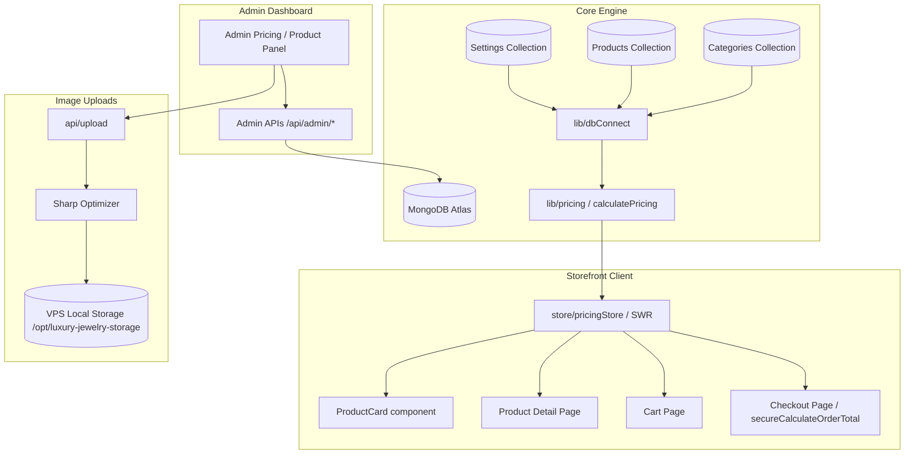
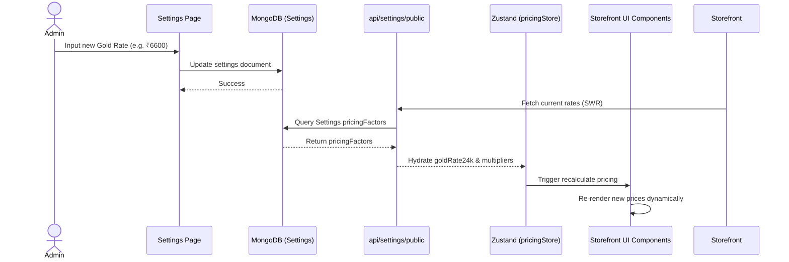

# DEVELOPER GUIDE — LUXURY JEWELRY PLATFORM ARCHITECTURE

Welcome to the Luxury Jewelry developer guide. This document is a comprehensive, implementation-level technical architecture and onboarding guide for engineering teams maintaining and extending the Luxury Jewelry platform.

---

## 1. Project Overview

Luxury Jewelry is a luxury online jewelry storefront powered by a dynamic, database-driven pricing engine. Unlike typical e-commerce storefronts that display static prices, Luxury Jewelry computes real-time pricing based on gold market rates, gemstone and diamond pricing grades, category making charge percentages, and size/length weight calculations.

### Tech Stack
* **Framework**: Next.js (utilizing App Router and Turbopack builds)
* **Database & ORM**: MongoDB with Mongoose
* **Styling**: Vanilla CSS and Tailwind CSS
* **State Management**: Zustand (for client-side selections, cart state, and currency stores)
* **Data Fetching**: SWR (stale-while-revalidate client hooks)
* **Media Processor**: Sharp (optimized WebP image uploads)
* **Storage**: VPS Local Storage outside repository boundaries (`/opt/luxury-jewelry-storage`)

### High-Level Architecture



---

## 2. Repository Structure

Below is an overview of the key folders within the Luxury Jewelry repository:

```text
/
├── app/                  # Next.js App Router (pages, layouts, and API routes)
├── components/           # Reusable React UI components (ProductCard, Admin layout)
├── lib/                  # Core modules (pricing calculator, database client, auth config)
├── models/               # Mongoose schemas (Product, Category, Settings, Order, Blog)
├── store/                # Zustand stores (pricing, cart, currency, config selection)
├── scripts/              # Command-line developer utilities (migrations, audits, certification)
├── public/               # Static assets (logos, icons, placeholders)
└── docs/                 # Platform architecture and operations documentation
```

### Key Folders Details

#### `app/`
* **Purpose**: Next.js routing and server-side endpoints.
* **Critical Files**: 
  * `app/admin/(dashboard)/pricing/debug/page.tsx` (pricing sandbox tool)
  * `app/api/admin/products/[id]/route.ts` (validation schema for product updates)
  * `app/api/create-order/route.ts` (checkout total server recertification)

#### `components/`
* **Purpose**: Storefront layout elements, navigations, and grids.
* **Critical Files**:
  * `components/ProductCard.tsx` (product presentation card)
  * `components/new-ui/ProductInteractiveUI.tsx` (PDP interactive configuration selection panel)

#### `lib/`
* **Purpose**: Core business logic and system-wide utilities.
* **Critical Files**:
  * [`lib/pricing.ts`](file:///c:/Users/lenovo/Desktop/jewellery-website/lib/pricing.ts) (core math pricing calculation pipeline)
  * [`lib/pricing.server.ts`](file:///c:/Users/lenovo/Desktop/jewellery-website/lib/pricing.server.ts) (secure server-side recalculator utilizing plain JSON structures)
  * [`lib/imageResolver.ts`](file:///c:/Users/lenovo/Desktop/jewellery-website/lib/imageResolver.ts) (legacy paths and custom WebP asset mapping)
  * [`lib/db.ts`](file:///c:/Users/lenovo/Desktop/jewellery-website/lib/db.ts) (Mongoose database connection handler)

#### `models/`
* **Purpose**: Mongoose schemas enforcing document types.
* **Critical Files**:
  * [`models/Product.ts`](file:///c:/Users/lenovo/Desktop/jewellery-website/models/Product.ts) (defines jewelry composition, specs map, and dynamic overrides)
  * [`models/Settings.ts`](file:///c:/Users/lenovo/Desktop/jewellery-website/models/Settings.ts) (stores global gold rates, diamond prices, gemstone prices, and purity multipliers)

#### `store/`
* **Purpose**: Client-side state managers tracking configuration selections.
* **Critical Files**:
  * `store/pricingStore.ts` (coordinates fetched settings caching and gold rate state)
  * `store/cartStore.ts` (stores configuration options for added cart items)

---

## 3. MongoDB Models

Luxury Jewelry models are mapped to the database using Mongoose. Here are the core specifications of the primary models:

### `Product`
* **Purpose**: Enforces schemas for all rings, chains, bracelets, bangles, and gemstone composition items.
* **Relationships**: Relates to `Category` via the `category` slug field.
* **Critical Fields**:
  * `baseWeight` (Number): Base gold weight in grams.
  * `jewelryType` (String): composition validator (`'gold' | 'diamond' | 'stone' | 'mixed'`).
  * `stoneType` (String): Specific gemstone type matching settings rates (e.g., `'ruby'`).
  * `diamondWeightCarats` (Number): Carats of diamond stone.
  * `pricingOverrides` (Mixed): Product-specific offsets or custom making charge fixed/percentage values.

### `Category`
* **Purpose**: Manages structural templates, base weights sizing formulas, and default making charges.
* **Critical Fields**:
  * `slug` (String, Unique): ID matching product categories (e.g., `'rings'`).
  * `config.makingCharges` (Object): `{ type: 'percentage' | 'fixed', value: number }` category formula.
  * `config.weightRules` (Object): Sizing multipliers for adjusting gold weights dynamically.

### `Settings`
* **Purpose**: Single source of truth settings document containing market-wide factors.
* **Critical Fields**:
  * `pricingFactors.metalRates.gold24k` (Number): 24K base rate per gram.
  * `pricingFactors.diamondPrices` (Map of Numbers): Grade per-carat price lookup table.
  * `pricingFactors.gemstonePrices` (Map of Numbers): Gemstone per-carat price lookup table.
  * `pricingFactors.purityMultipliers` (Map of Numbers): Multiplier lookup for gold carats.
  * `pricingFactors.gstPercentage` (Number, Defaults to `3`): GST rate.

### `Order`
* **Purpose**: Persists placed orders.
* **Critical Fields**:
  * `items.priceSnapshot` (Number): Snapshotted total at order creation, ensuring pricing history is immutable.
  * `items.configuration` (Object): Config selection (metal, purity, size, stone grade) chosen by user.

---

## 4. Product Data Model Details

Products use dynamic attributes to compute weight and price. Here is how attributes map to calculations and UI selectors:

| Field Name | Type | Editable by Admin | Affects Pricing | Storefront Function |
|:---|:---|:---:|:---:|:---|
| `baseWeight` | Number | Yes | Yes | Baseline weight in grams before size adjustments |
| `jewelryType` | String | Yes | Yes | Enforces whether diamond, stone, or gold calculations run |
| `stoneType` | String | Yes | Yes | Determines which rate key from gemstone prices applies |
| `diamondWeightCarats` | Number | Yes | Yes | Total diamond weight multiplied by grade rate |
| `defaultMetal` | String | Yes | No | Pre-selects metal configuration on catalog cards |
| `configurableOptions` | Object | Yes | No | Populates active dropdown choices for customer customization |
| `pricingOverrides` | Mixed | Yes | Yes | Implements fixed/percentage overrides and weight offsets |
| `categoryConfig` | Object | Read-only | Yes | Injected category rules containing formulas |
| `images` | Array | Yes | No | Gallery assets resolved via helper |
| `variantImages` | Map | Yes | No | maps selected metal type (e.g. platinum) to specific images |

---

## 5. Pricing Architecture

The dynamic pricing calculation is implemented in [`lib/pricing.ts`](file:///c:/Users/lenovo/Desktop/jewellery-website/lib/pricing.ts).

### Final Price Equation

$$\text{Final Price} = \left( \text{Gold Price} + \text{Stone Price} + \text{Making Charges} \right) \times \left( 1 + \frac{\text{GST Percentage}}{100} \right)$$

All component parameters are computed as follows:

### 1. Gold Price Calculation

$$\text{Gold Price} = \text{Estimated Gold Weight} \times \text{24K Gold Rate} \times \text{Purity Multiplier} \times \left( 1 + \frac{\text{Purity Adjustment}}{100} \right)$$

* **Purity Multipliers Table** (Configured in Global Settings):
  * **24K**: 1.000
  * **22K**: 0.916
  * **18K**: 0.750
  * **14K**: 0.585
  * **9K**: 0.375

### 2. Diamond Price Calculation
If `jewelryType === 'diamond'` and no product override price is active:

$$\text{Diamond Price} = \text{Diamond Weight (ct)} \times \text{Diamond Grade Rate} \times \left( 1 + \frac{\text{Diamond Quality Adjustment}}{100} \right)$$

* **Standard Quality Grade Keys**:
  * `EF-VVS`
  * `GH-VS`
  * `GHI-VS`
  * `FG-SI`
  * `IJ-SI`
  * `Diamond-Standard`

### 3. Gemstone Price Calculation
If `jewelryType === 'stone'` and no product override price is active:

$$\text{Stone Price} = \text{Stone Weight (specs.stoneWeight)} \times \text{Stone Rate} \times \left( 1 + \frac{\text{Stone Quality Adjustment}}{100} \right)$$

* **Supported Gemstone Keys**:
  * `ruby`
  * `emerald`
  * `sapphire`
  * `moissanite`
  * `cz`
  * `default`

### 4. Making Charges Lookup Precedence
The system scans these hierarchy layers sequentially, applying the first match it discovers:

```text
[1. Product Override]      --> Found in product.pricingOverrides.makingCharges {type, value}
         ↓
[2. Category Override]     --> Found in product.categoryOverrides.makingCharges {type, value}
         ↓
[3. Category Formula]      --> Found in product.categoryConfig.makingCharges {type, value}
         ↓
[4. Product Legacy Value]  --> Fallback flat number stored on product.makingCharges
         ↓
[5. Global Fallback]       --> Default value of 15% of computed Gold Price
```

### 5. GST Config
A flat **3% GST** is applied. It is configured in the `Settings` schema under `pricingFactors.gstPercentage` (falling back to `3` if undefined).

---

## 6. Size & Weight Rules

Weight is dynamically adjusted based on the size or length selected by the user, using equations configured in Category rules.

### Category Sizing Adjustments

#### 1. Rings (Rings Category)
Rings scale by Ring Size (standard base size = 12).
* **Formula**:

$$\text{Estimated Weight} = \text{baseWeight} + \left( \left( \text{Selected Size} - \text{Base Size (12)} \right) \times \text{sizeIncrementWeight} \right)$$

* **Example Calculation** (For `baseWeight = 15.0g`, `sizeIncrementWeight = 0.12g`):
  * **Size 12**: $15.00g$
  * **Size 13**: $15.0 + (1 \times 0.12) = 15.12g$
  * **Size 14**: $15.0 + (2 \times 0.12) = 15.24g$

#### 2. Bangles (Bangles Category)
Bangles scale by step sizes matching 2.4, 2.6, 2.8 increments (where base size = 2.4, step = 0.2).
* **Formula**:

$$\text{Estimated Weight} = \text{baseWeight} + \left( \left( \frac{\text{Selected Size} - 2.4}{0.2} \right) \times \text{sizeIncrementWeight} \right)$$

#### 3. Chains (Chains Category)
Chains scale based on chain length in inches (base length = 20 inches).
* **Formula**:

$$\text{Estimated Weight} = \text{baseWeight} + \left( \left( \text{Selected Length} - 20 \right) \times \text{lengthIncrementWeight} \right)$$

#### 4. Bracelets (Bracelets Category)
Bracelets accept both numeric lengths and alphabet letter steps (S, M, L, XL), mapping offset modifiers:
* **Small (S)**: Offset = -1
* **Medium (M)**: Offset = 0
* **Large (L)**: Offset = 1
* **Extra Large (XL)**: Offset = 2
* **Formula**:

$$\text{Estimated Weight} = \text{baseWeight} + \left( \text{Offset} \times \text{lengthIncrementWeight} \right)$$

---

## 7. Global Pricing System Data Flow

The global gold rate authority propagates pricing updates downstream through storefront components.



---

## 8. Data Flow Architecture

### Price Calculation Engine Flowchart

```text
  Settings Rates & Adjustments
               +
        Category Rules
               +
         Product Specs
               +
  User Config Selections (Metal, Purity, Size, Stone)
               │
               ▼
      [calculatePricing()]
               │
   ┌───────────┼───────────┬───────────┐
   ▼           ▼           ▼           ▼
[Card]       [PDP]      [Cart]     [Checkout]
                                       │
                                       ▼
                              [secureCalculateOrderTotal]
                                       │
                                       ▼
                                  [Order DB]
```

### Admin Operations and Cache Invalidation
When an Admin updates a product, the route calls Next.js `revalidatePath()` to clear caches:
```typescript
const product = await Product.findByIdAndUpdate(id, body, { new: true });
revalidatePath('/');
revalidatePath('/products');
revalidatePath(`/product/${product.slug}`);
revalidatePath(`/category/${product.category}`);
```

---

## 9. Images & Media Architecture

Luxury Jewelry isolates dynamic media assets from the deployment repository to optimize build speed and prevent workspace git bloat.

### VPS Storage Directory Structure
All user and admin uploads are saved in `/opt/luxury-jewelry-storage` (fallback path on Windows systems: `C:\opt\luxury-jewelry-storage`).

```text
/opt/luxury-jewelry-storage/
└── public/
    └── images/
        ├── products/
        │   ├── rings/
        │   └── bangles/
        ├── blogs/
        ├── hero/
        └── misc/
```

### Upload Image Processing
During admin product uploads, the handler in `app/api/upload/route.ts` optimizes images:
1. **Size check**: Restricts size limit to **5MB**.
2. **Sharp optimization**:
   * Scales image down to a maximum width of **1600px**.
   * Converts format to **WebP** at a quality setting of **82**.
   * Automatically strips EXIF metadata to ensure privacy and reduce file sizes.
3. **Storage**: Writes optimized WebP files to `/opt/luxury-jewelry-storage/public/images/products/[category]/`.

### Dynamic Path Resolution
Client rendering accesses images using [`lib/imageResolver.ts`](file:///c:/Users/lenovo/Desktop/jewellery-website/lib/imageResolver.ts). Legacy images are mapped to `/images/images/product/` fallback paths, while newly uploaded assets resolve using modern root path templates (e.g. `/images/products/[category]/[safe-name].webp`).

---

## 10. Product Card vs PDP Parity System

A critical requirement of the Luxury Jewelry storefront is price consistency: a product card must never show a different price than the PDP initial state, the checkout cart, or the server-calculated order total.

To guarantee parity:
1. **No manual calculations**: Never implement ad-hoc pricing math equations inside views or components.
2. **Default Configurations**: Product list cards load dynamic prices by calling:
   ```typescript
   import { sharedDefaultProductConfiguration } from '@/lib/ecommerce';
   import { calculatePricing } from '@/lib/pricing';
   
   const config = sharedDefaultProductConfiguration(product);
   const pricing = calculatePricing(product, config, globalRates);
   ```
3. **Server-Side Validation**: Checkout items are recalculated on the server in `lib/pricing.server.ts` by executing the exact same `calculatePricing` engine before placing the order, ensuring total price calculations are secure.

---

## 11. Admin Panel Architecture

The Admin dashboard manages platform collections:

### 1. Products Module
* **Backend Model**: `Product`
* **API Endpoints**: `app/api/admin/products` and `[id]/route.ts` (GET, POST, PATCH, DELETE)
* **Effects**: Clears paths cache on update/save, updating list prices across catalog grids.

### 2. Pricing Module
* **Backend Model**: `Settings`
* **API Endpoints**: `app/api/admin/pricing-rules/route.ts` (PATCH)
* **Effects**: Modifies gold rates, purity multipliers, and diamond/gemstone lookup values globally.

### 3. Orders Module
* **Backend Model**: `Order`
* **API Endpoints**: `app/api/admin/orders` and `[id]/route.ts`
* **Effects**: Manage order fulfillment statuses and displays historical snapshotted prices.

---

## 12. API Reference

### 1. Public Settings Endpoint
* **Route**: `/api/settings/public`
* **Method**: `GET`
* **Purpose**: Fetches active gold rates, GST, and stone rates.
* **Returns**:
  ```json
  {
    "success": true,
    "data": {
      "metalRates": { "gold24k": 6500 },
      "purityMultipliers": { "18K": 0.75 },
      "gstPercentage": 3
    }
  }
  ```

### 2. Product Upload Endpoint
* **Route**: `/api/upload`
* **Method**: `POST`
* **Input**: Multipart Form Data (`file: File`, `category: string`, `type: 'product' | 'blog'`)
* **Returns**:
  ```json
  {
    "success": true,
    "data": [{ "url": "/images/products/rings/diamond-ring-92a8c.webp", "name": "diamond-ring-92a8c.webp" }]
  }
  ```

---

## 13. Debugging Guide

### Common Troubleshooting Scenarios

#### 1. Product Card Price Mismatch with PDP Price
* **Check `sharedDefaultProductConfiguration`**: Verify that the client is not using local overrides on the PDP initial mount that deviate from default config structures.
* **Verify `baseWeight` and `defaultMetal`**: Verify the product document has both variables defined in Mongoose. If `defaultMetal` is missing, the card falls back to `'yellow-gold'` while the PDP might default to a different metal, causing mismatched calculations.

#### 2. Diamond Price resolves as ₹0
* **Verify `jewelryType`**: Ensure `jewelryType` is set to `'diamond'` or `'mixed'`.
* **Check weight field**: Ensure `diamondWeightCarats` is greater than 0, or `specs.diamondWeight` is defined.
* **Lookup rate**: Check that the select option grade (e.g. `EF-VVS`) matches the keys configured in the database global settings.

#### 3. Image assets return 404
* **Verify VPS Storage link**: Next.js requires a symbolic link or static router configured to serve images from outside the project root. On production servers, check that Nginx is configured to alias `/images/` paths to `/opt/luxury-jewelry-storage/public/images/`.

---

## 14. Production Deployment

### Directory Dependencies
On production servers, verify that the media storage root directory is created and has correct write permissions:
```bash
mkdir -p /opt/luxury-jewelry-storage/public/images/products
chown -R www-data:www-data /opt/luxury-jewelry-storage
chmod -R 775 /opt/luxury-jewelry-storage
```

### Environment Settings
Verify the following variables are configured in the `.env.local` file:
```text
MONGODB_URI=mongodb+srv://...
STORAGE_ROOT=/opt/luxury-jewelry-storage
NEXTAUTH_SECRET=your-auth-secret
NEXT_PUBLIC_API_URL=https://yourdomain.com
```

### Build & Run
Compile the static pages and startup process:
```bash
npm run build
npm start
```

---

## 15. Developer Guidelines

### Best Practices

* **DO**:
  * ✓ Compute dynamic jewelry pricing using `calculatePricing()`.
  * ✓ Pre-select initial customer selections using `sharedDefaultProductConfiguration()`.
  * ✓ Leverage `pricingStore` to retrieve global pricing factor rates.
  * ✓ Maintain clean, database-driven formulas inside Mongoose settings.

* **DON'T**:
  * ✗ Hardcode prices in storefront components or cards.
  * ✗ Store admin image uploads inside the workspace `/public` directory.
  * ✗ Duplicate ring or chain sizing math logic across multiple pages.
  * ✗ Serialize mongoose instances directly to calculate functions—always use JSON parsing (`JSON.parse(JSON.stringify(doc))`).
